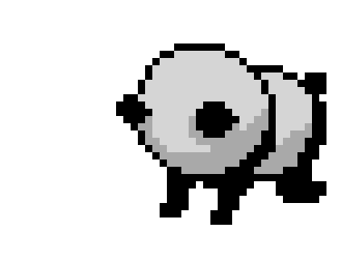
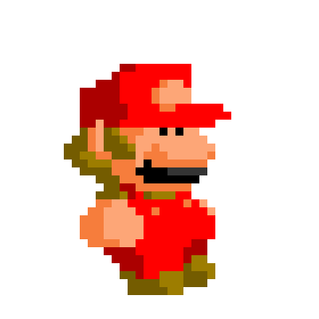

 
# To Do List

This project has basic function like adding task list. Displaying the task name, when it was created and a check box to indicate that the task is done. You can also update the task list created and you can also delte the task once done.


## Creating the Database and Table

Create the `database` and name it `to_do_list`. Create then a table that has name `todos` and inside the parenthesis, make sure to use the following command below. 

~~~sql
CREATE DATABASE to_do_list;
USE to_do_list;

CREATE TABLE todos (
  'id'  INT(11) AUTO_INCREMENT PRIMARY KEY,
  'title' TEXT(30) NOT NULL,
  'date_time' datetime NOT NULL DEFAULT current_timestamp(),
  'checked' tinyint(1) NOT NULL DEFAULT 0

);
~~~

## Creating the Config file 

Following the creation of the table, we must write a PHP script to connect to the MySQL database server. Create a file called `connection.php` and paste the code below into it.
We'll use the PHP `require` function to include this config file on other pages later. In addition we use pdo type of connection

```php
<?php 
$sName = "localhost";
$uName = "root";
$pass = "";
$db_name = "to_do_list";
 
try {
    $conn = new PDO("mysql:host=$sName;dbname=$db_name", 
                    $uName, $pass);
    $conn->setAttribute(PDO::ATTR_ERRMODE, PDO::ERRMODE_EXCEPTION);
}catch(PDOException $e){
  echo "Connection failed : ". $e->getMessage();
}

```
Note: Before testing this code, replace the credentials with your MySQL server's settings, for example, replace the database name `'to_do_list'` with your own database name, username `'root'` with your own database username, and specify a database password if one exists.

## Creating the Landing Page 

Landing Page shows the index page or the first page of the Web Application. It display the Input text, add button and different todo-items recorded in the database table.
It also has action icons for each todo-item, which allow you to edit, delete, check and uncheck.
```php
<?php 
require 'connection.php';
?>
<!DOCTYPE html>
<html lang="en">
<head>
    <meta charset="UTF-8">
    <meta name="viewport" content="width=device-width, initial-scale=1.0">
    <meta http-equiv="X-UA-Compatible" content="ie=edge">
    <title>To-Do List</title>
    <link href="https://cdn.jsdelivr.net/npm/bootstrap@5.1.3/dist/css/bootstrap.min.css" rel="stylesheet" integrity="sha384-1BmE4kWBq78iYhFldvKuhfTAU6auU8tT94WrHftjDbrCEXSU1oBoqyl2QvZ6jIW3" crossorigin="anonymous">
    <link rel="stylesheet" href="style.css">
    
</head>
<body>
    <div class="main-section">
       <div class="add-section">
       <h2 class='headertext'>TO DO LIST </h2>
          <form action="add.php" method="POST" autocomplete="off">
             <?php if(isset($_GET['mess']) && $_GET['mess'] == 'error'){ ?>
                <input type="text" 
                     name="title" 
                     style="border-color: #ff6666"
                     placeholder="This field is required" />
                 <button type="submit">Add</span></button>
             <?php }else{ ?>
        
              <input type="text" 
                     name="title" 
                     placeholder="What needs to be done?" />
              <button type="submit">Add</span></button>
             <?php } ?>
          </form>
       </div>
       <?php 
          $todos = $conn->query("SELECT * FROM todos ORDER BY id DESC");
       ?>
       <div class="show-todo-section">
            <?php if($todos->rowCount() <= 0){ ?>
                <div class="todo-item">
                    <div class="empty">
                        
                        
                    </div>
                </div>
            <?php } ?>

            <?php while($todo = $todos->fetch(PDO::FETCH_ASSOC)) { ?>
                <div class="todo-item">
                    <span id="<?php echo $todo['id']; ?>"
                          class="remove-to-do">x</span>
                    <?php if($todo['checked']){ ?> 
                        <input type="checkbox"
                               class="check-box"
                               data-todo-id ="<?php echo $todo['id']; ?>"
                               checked />
                        <h2 class="checked"><?php echo $todo['title'] ?></h2>
                    <?php }else { ?>
                        <input type="checkbox"
                               data-todo-id ="<?php echo $todo['id']; ?>"
                               class="check-box" />
                        <h2><?php echo $todo['title'] ?></h2>
                    <?php } ?>
                    <br>
                    <small>created: <?php echo $todo['date_time'] ?></small>
                    <a class="btn btn-success btn-sm" href="edit.php?id=<?php echo $todo['id']; ?>" role="button">Edit</a> 
                </div>
            <?php } ?>
       </div>
    </div>
    <script src="js/jquery-3.2.1.min.js"></script>
    <script>
        $(document).ready(function(){
            $('.remove-to-do').click(function(){
                const id = $(this).attr('id');              
                $.post("remove.php", 
                      {
                          id: id
                      },
                      (data)  => {
                         if(data){
                             $(this).parent().hide(600);
                         }
                      }
                );
            });
            $(".check-box").click(function(e){
                const id = $(this).attr('data-todo-id');
                
                $.post('check.php', 
                      {
                          id: id
                      },
                      (data) => {
                          if(data != 'error'){
                              const h2 = $(this).next();
                              if(data === '1'){
                                  h2.removeClass('checked');
                              }else {
                                  h2.addClass('checked');
                              }
                          }
                      }
                );
            });
        });
    </script>
</body>
</html>
```

## Creating Read Page

Read Page is the one that that will retrieve / view the specific entries in our program. The Read page will represent as the face of the whole program. The data retrieved will be from the `todos` table
